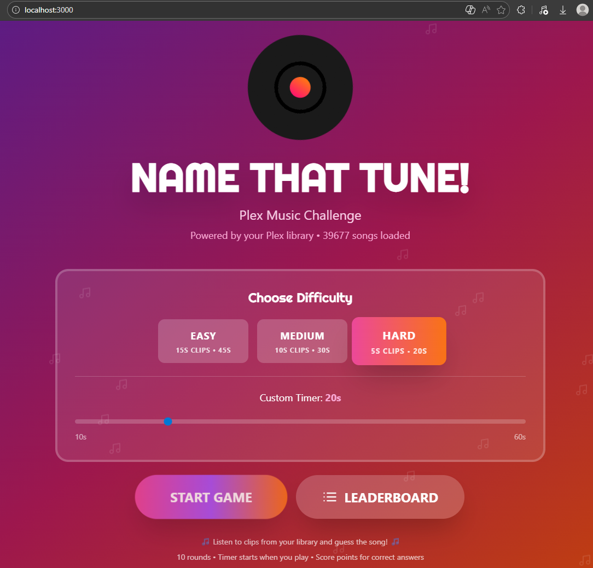
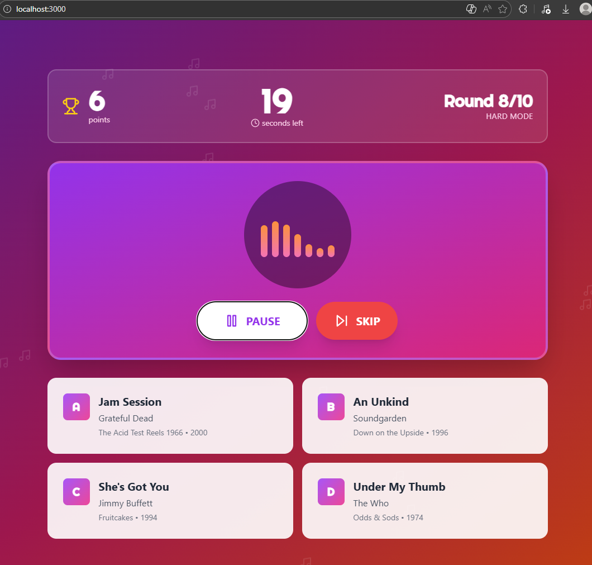
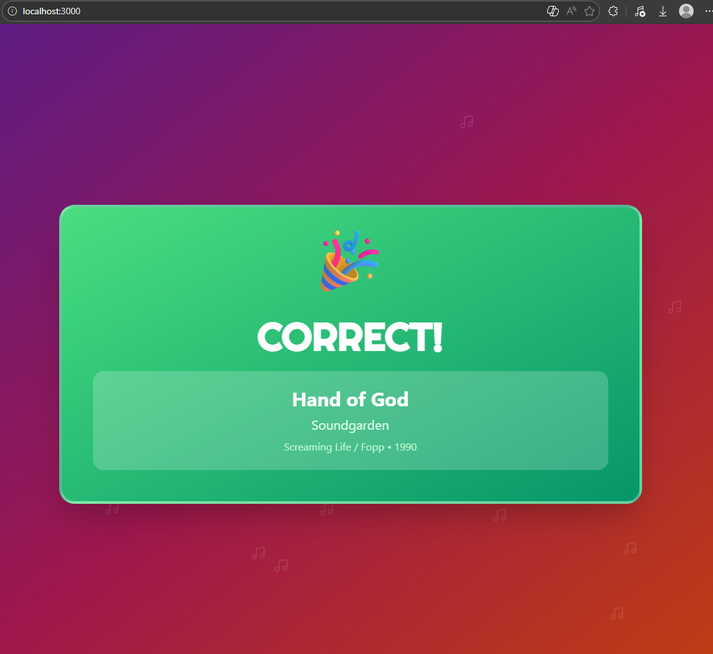

# Plex Music Trivia Game

A web-based music trivia game using your Plex music library. Listen to clips and guess the song from multiple choice options.





## Features

- Three difficulty levels (Easy, Medium, Hard) with configurable timers
- Cross-device leaderboard with time-based rankings
- Real-time audio streaming from your Plex server
- Mobile-friendly responsive design
- 10 rounds per game





## Quick Start

### Prerequisites

- Docker and Docker Compose
- Plex Media Server with a music library
- Plex authentication token

### Get Your Plex Token
If you have Plex Desktop you can find it in 'C:\Users\[USER]\AppData\Local\Plex\Plex Media Server\Preferences.xml'.
OR
1. Go to https://app.plex.tv and play any media
2. Click the menu (⋯) → "Get Info" → "View XML"
3. Copy the token from the URL: `X-Plex-Token=YOUR_TOKEN`

More details: https://support.plex.tv/articles/204059436

### Installation

```bash
git clone https://github.com/whosliam/Plex-Music-Trivia-Game.git
cd Plex-Music-Trivia-Game
```

Edit `docker-compose.yml`:

```yaml
environment:
  - PLEX_URL=http://192.168.1.100:32400
  - PLEX_TOKEN=your_actual_token_here
```

Run:

```bash
docker-compose up -d
```

Access at: `http://localhost:3000`

## Configuration

### Difficulty Settings

| Difficulty | Clip Length | Timer |
|------------|-------------|-------|
| Easy | 15 seconds | 45 seconds |
| Medium | 10 seconds | 30 seconds |
| Hard | 5 seconds | 20 seconds |

Custom timer: 10-60 seconds (configurable in-game)

### Leaderboard Scoring

```
Score = (Correct Answers × 100) - (Total Time ÷ 10)
```

Examples:
- 10/10 in 60s = 994 points
- 10/10 in 120s = 988 points
- 8/10 in 60s = 794 points

## Network Access

Access from other devices on your network:

```
http://YOUR_HOST_IP:3000
```

Ubuntu firewall:
```bash
sudo ufw allow 3000/tcp
```

## Troubleshooting

**No songs loading:**
- Verify Plex is running and accessible
- Check `PLEX_URL` and `PLEX_TOKEN` are correct
- Ensure you have a music library in Plex

**Audio not playing:**
- Check browser console for errors
- View Docker logs: `docker-compose logs`

**Port conflict:**
```yaml
ports:
  - "8080:3000"  # Use port 8080 instead
```

## License

MIT License - See LICENSE file

## Built With

Node.js • Express • React • Tailwind CSS • Docker
